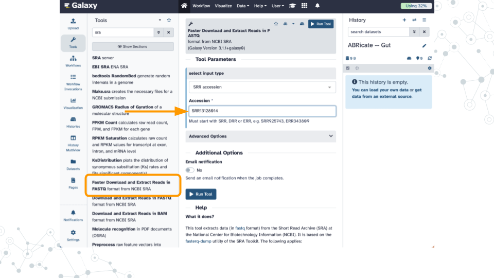
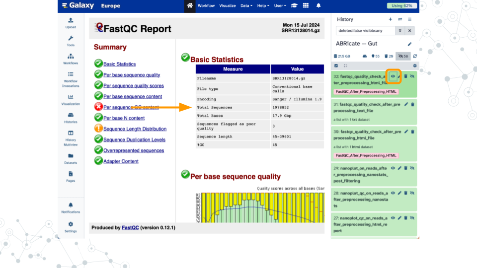
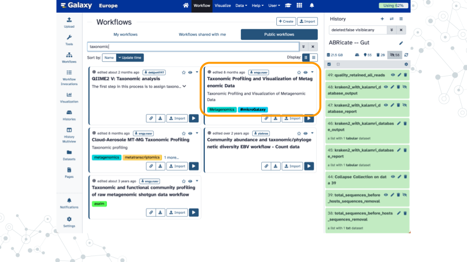
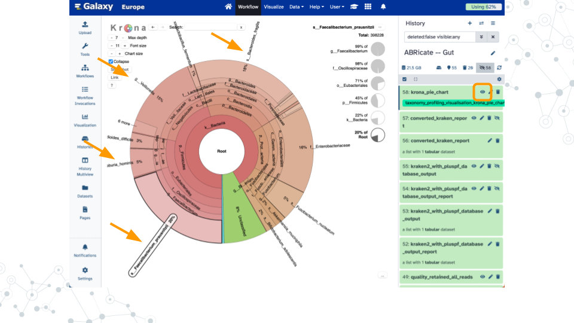
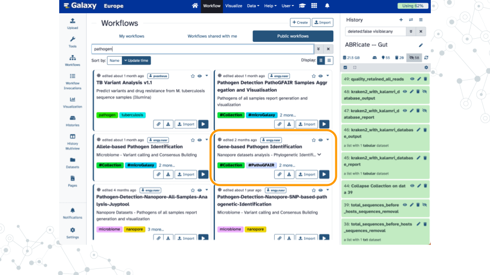
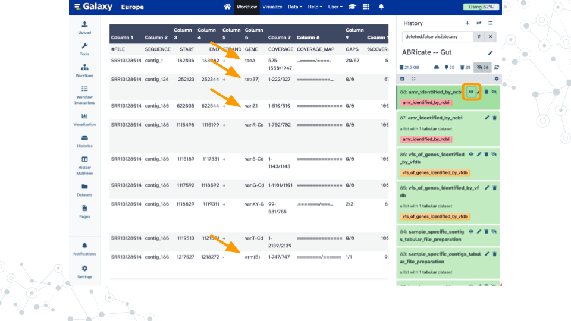

# Finding AMRs

<h2>Introduction</h2>

[Antimicrobial resistance genes](https://en.wikipedia.org/wiki/Antimicrobial_resistance) (AMR genes) allow microbes to counteract the effects of antimicrobial drugs used to treat infections.
Databases such as the [NCBI Pathogen Detection Reference Gene Catalog](https://www.ncbi.nlm.nih.gov/pathogens/antimicrobial-resistance) and the [Comprehensive Antibiotic Resistance Database](https://card.mcmaster.ca) contain thousands of curated resistance genes and help make AMR-related data more widely available.
Here we use the [ABRicate](https://github.com/tseemann/abricate) tool which can mass screen contigs for antimicrobial genes using a variety of databases including the NCBI database.
We will analyze the ZymoBIOMICS [Gut Microbiome Standard](https://www.zymoresearch.com/products/zymobiomics-gut-microbiome-standard) which contains "21 different strains to mimic the human gut microbiome" and has been sequenced using PacBio Hi-Fi long read technology ((SRR13128014)[https://www.ncbi.nlm.nih.gov/sra/?term=SRR13128014]).
A similar strategy can be used to screen for virulence factors using databases such as the [Virulence Factor Database](https://pubmed.gov/34850947) (VFDB).

### Get Data

### PacBio Preprocessing

### Taxonomic Profiling

### Gene-based Pathogen Identification

<h2>Footnotes</h2>

<h3>Contributions and Affiliations</h3>

- Jennifer Kerr, Notre Dame of Maryland University
- Frederick Tan, Johns Hopkins University
- Based on "Pathogen detection from (direct Nanopore) sequencing data using Galaxy - Foodborne Edition" ([GTN](https://gxy.io/GTN:T00393))

Last Revised: August 5, 2024
