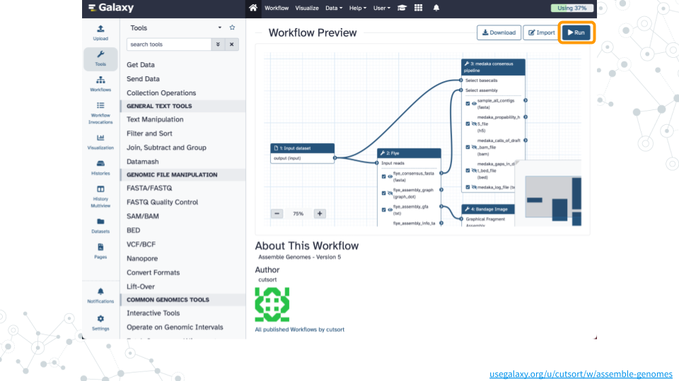
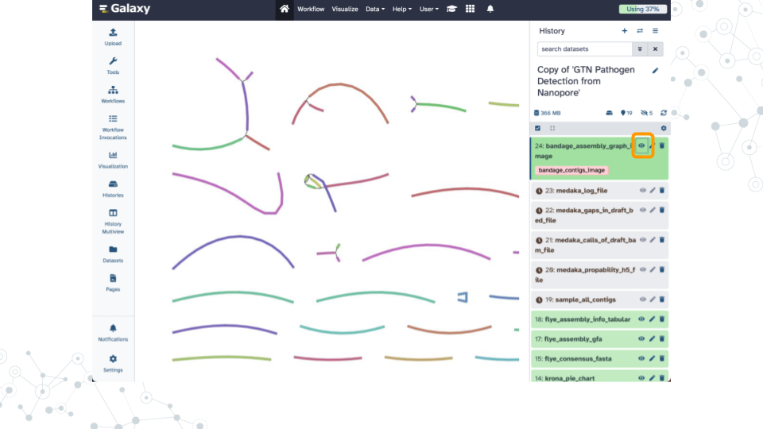

# Finding AMRs

### Overview {-}

#### Purpose {-}

#### Learning Objectives {-}

#### Introduction {-}

[Antimicrobial resistance genes](https://en.wikipedia.org/wiki/Antimicrobial_resistance) (AMR genes) allow microbes to counteract the effects of antimicrobial drugs used to treat infections.
Databases such as the [NCBI Pathogen Detection Reference Gene Catalog](https://www.ncbi.nlm.nih.gov/pathogens/antimicrobial-resistance) and the [Comprehensive Antibiotic Resistance Database](https://card.mcmaster.ca) contain thousands of curated resistance genes and help make AMR-related data more widely available.
Here we use the [ABRicate](https://github.com/tseemann/abricate) tool which can mass screen contigs for antimicrobial genes using a variety of databases including the NCBI database.
A similar strategy can be used to screen for virulence factors using databases such as the [Virulence Factor Database](https://pubmed.gov/34850947) (VFDB).

[[slides](https://docs.google.com/presentation/d/1pGSI4gxjeCLLakuwgSW0V7EuGT4F6av-CYMkqpcnlDE){target="_blank"}]
[[video](https://drive.google.com/file/d/11qoAymp6GNpW5ftRnLP7oj_nX2HzABzk){target="_blank"}]

### **Activity 1** -- Assemble Genomes {-}

*Estimated time: 45 min*

#### Instructions {-}

##### 1. Run workflow {-}

- Open the [Assemble Genomes](https://usegalaxy.org/u/cutsort/w/assemble-genomes){target="_blank"} public workflow
- Click on `Run` and then `Run Workflow` on the `fastp on data 5: Read 1 output` dataset
- Wait ~30 minutes as the Flye, Bandage, and medaka jobs are scheduled, run, and complete

##### 2. View results {-}

- Click on the Display icon (eyeball) next to the dataset tagged `bandage_contigs_image`
- Examine how many contigs are large vs small, linear vs branched

#### Questions {-}

You can refer to [this completed history](https://usegalaxy.org/u/cutsort/h/finding-amrs-complete){target="_blank"} to answer these questions while you wait for your jobs to complete.

| 1A. How many contigs were assembled? |
|:-|
|   |

 

| 1B. Why did flye separate these in this way? How does flye decide to group them into this numbers of contigs? |
|:-|
|   |

### **Activity 2** -- Finding AMRs {-}

*Estimated time: 15 min*

#### Instructions {-}

##### 1. Run ABRicate {-}

- Select "Tools" in the left menu, search for `abr`, and click on the `ABRicate` tool
- Configure with the following parameters before clicking "Run Tool"
  - Input file: `sample_all_contigs`
  - Advanced options > Database to use: `NCBI Bacterial Antimicrobial Resistance Reference Gene Database`

##### 2. View results {-}

- Click on the Display icon (eyeball) next to the `ABRicate report file` dataset
- Examine how many contigs contain an antimicrobial gene (Column 2) and how many categories of resistance genes are found (Column 15)

#### Questions {-}

| 2A. How many antibiotic resistance genes were found in the sample? |
|:-|
|   |

 

| 2B. Which antibiotic genes were found on which contigs? |
|:-|
|   |

 

| 2C. What antibiotics are associated with the identified antibiotic genes?  What is the target of the antibiotic(s) and mechanism of action? |
|:-|
|   |

### Footnotes {-}

#### Resources {-}

- [Google Doc](https://docs.google.com/document/d/181wPtZti_a4RMgKeQXuLPcNjAIrxg4DX)

#### Contributions and Affiliations {-}

- Jennifer Kerr, Notre Dame of Maryland University
- Rosa Alcazar, Clovis Community College
- Frederick Tan, Johns Hopkins University
- Based on "Pathogen detection from (direct Nanopore) sequencing data using Galaxy - Foodborne Edition" ([GTN](https://gxy.io/GTN:T00393))

Last Revised: September 2024
