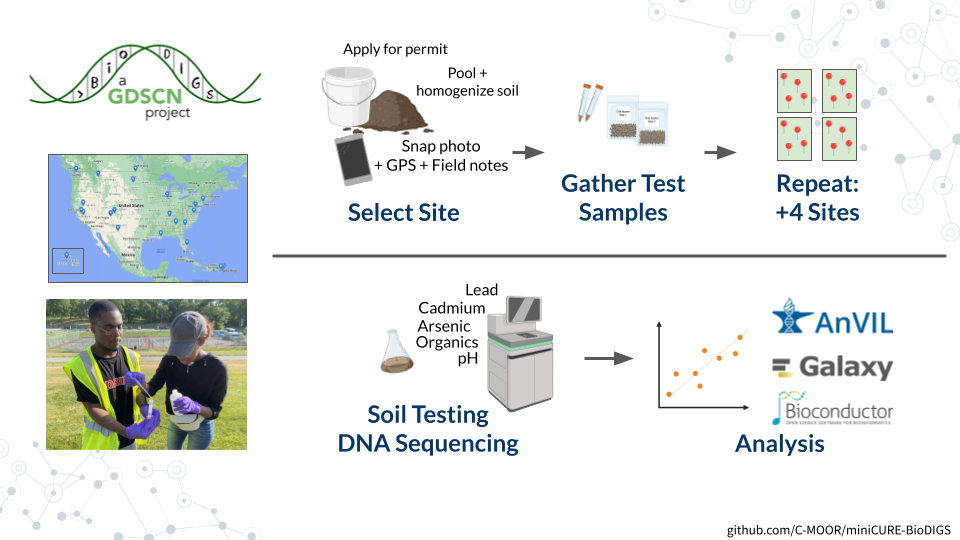

# About this Course {-}

This miniCURE allows students to develop a project using soil metagenomics datasets generated by the [GDSCN](https://www.gdscn.org){target="_blank"} [BioDIGS](http://biodigs.gdscn.org){target="_blank"} consortium to introduce the impact of microbes on human health and our environment, modern tools in microbiology, and advances in genome sequencing and genomic data science.

### Skills Level {- .unlisted}

### Learning Goals {- .unlisted}

### Core Competencies {- .unlisted}

### C-MOOR Collection {- .unlisted}
