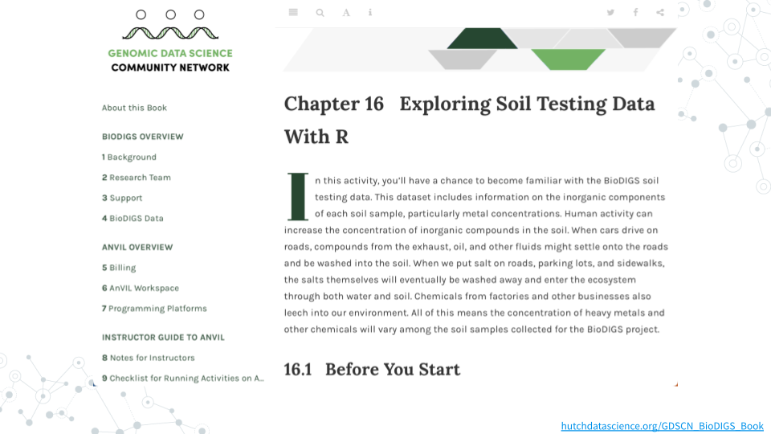
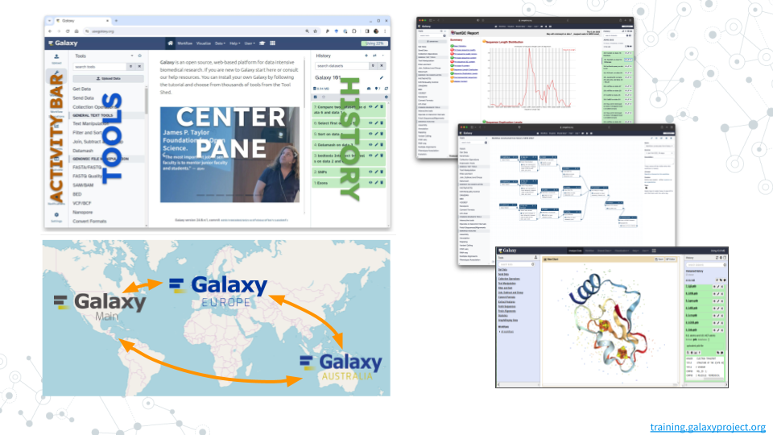
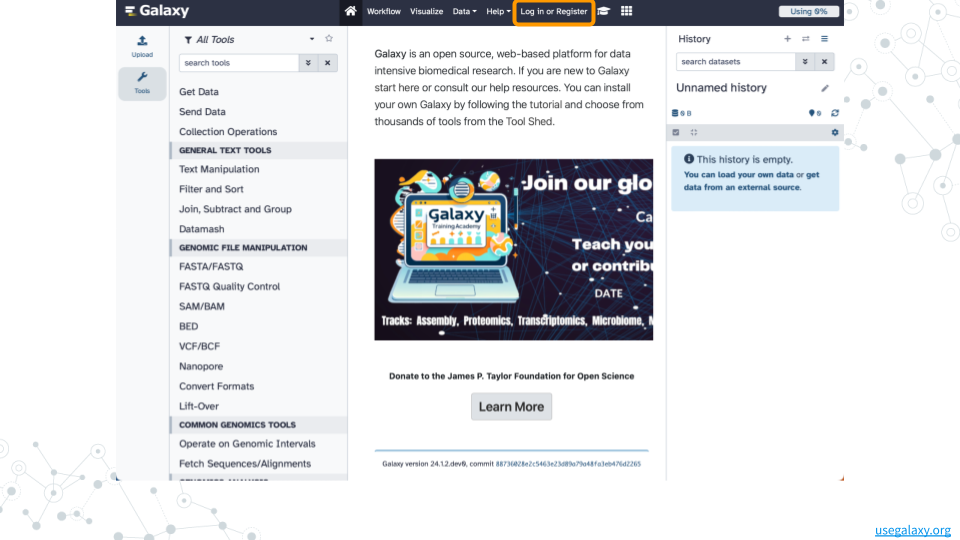

# Introduction

## C-MOOR BioDIGS Overview

The [C-MOOR](https://www.c-moor.org){target="_blank"} project works to create early research experiences through curricula like our [miniCUREs](http://science.c-moor.org/miniCURE-RNA-seq/c-moor-minicure-overview.html){target="_blank"} that help integrate data science and hands-on research into lower level coursework.
This particular miniCURE introduces students to soil metagenomics data generated by the GDSCN [BioDIGS](http://biodigs.gdscn.org){target="_blank"} consortium which researches soil biodiversity and ecological factors that impact human health and ecological concerns.
Students who complete this work are encouraged to dig deeper into the BioDIGS [book](https://hutchdatascience.org/GDSCN_BioDIGS_Book){target="_blank"} for additional datasets, tutorials, and community.

## The Scientific Process

## Join Galaxy

### Introduction

[Galaxy](https://galaxyproject.org){target="_blank"} is a free, open-source system for analyzing data, authoring workflows, training and education, publishing tools, managing infrastructure, and more.  Among the notable features:

- [Graphical user interface](https://training.galaxyproject.org/training-material/topics/introduction/tutorials/galaxy-intro-101/tutorial.html) (GUI) for interactively running tools
- [Toolshed](https://toolshed.g2.bx.psu.edu) with 10,000 tools ready to run
- Full featured [workflow](https://training.galaxyproject.org/training-material/topics/galaxy-interface/tutorials/workflow-editor/tutorial.html) functionality
- Terabytes of the latest, curated [reference data](https://galaxyproject.org/admin/reference-data-repo)
- Extensive training [tutorials](https://training.galaxyproject.org) and infrastructure
- Large international [community](https://galaxyproject.org/community) of users and developers

### Instructions

#### Create an account on Galaxy

1. Open [usegalaxy.org](https://www.usegalaxy.org){target="_blank"} in a web browser.
1. Click on “**Log in or Register**” in the top menu.
1. On the login page, find the **Register here** link and click on it.
1. Fill in the the registration form, then click on **Create**.
    - Your account should now get created, but will remain inactive until you verify the email address you provided in the registration form.

#### Confirm your email address

1. Check for a **Confirmation Email** in the email you used for account creation.
    - Missing? Check your **Trash** and **Spam** folders.
1. Click on the **Email confirmation link** to fully activate your account.

