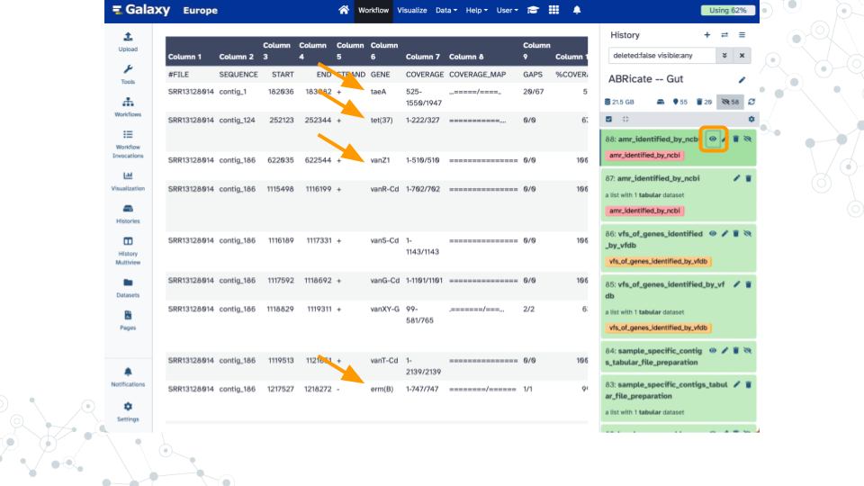

# Kickstart Project Work

### Overview {-}

#### Purpose {-}

#### Learning Objectives {-}

#### Introduction {-}

We will analyze the ZymoBIOMICS [Gut Microbiome Standard](https://www.zymoresearch.com/products/zymobiomics-gut-microbiome-standard) which contains "21 different strains to mimic the human gut microbiome" and has been sequenced using PacBio Hi-Fi long read technology ([SRR13128014](https://www.ncbi.nlm.nih.gov/sra/?term=SRR13128014)).

### **Activity 1** -- Get Data {-}

### **Activity 2** -- Taxonomy Profiling {-}

### **Activity 3** -- Finding AMRs {-}

### Footnotes {-}

#### Resources {-}

- Google Doc

#### Contributions and Affiliations {-}

- Jennifer Kerr, Notre Dame of Maryland University
- Frederick Tan, Johns Hopkins University
- Based on "Pathogen detection from (direct Nanopore) sequencing data using Galaxy - Foodborne Edition" ([GTN](https://gxy.io/GTN:T00393))

Last Revised: August 2024
