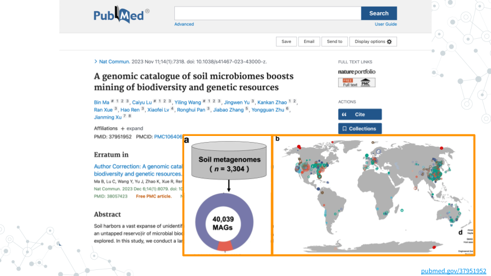

# (PART\*) Exploration and Discovery {-}

# Scientific Literature

Soil contains an estimated 59% +/-15% of the species diversity on Earth ([Anthony, Bender, and van der Heijden 2023](https://pubmed.gov/37549278){target="_blank"}).
To enable mining of this vast microbial biodiversity and genetic resource, Ma and colleagues created a genomic catalogue by analyzing 3,304 soil metagenomes ([Ma et al 2023](https://pubmed.gov/37951952){target="_blank"}).
Dig into this paper to learn more about how the authors reconstructed 40,039 soil metagenome-assembled genome bins (the SMAG catalogue) to identify previously uncharacterized archael and bacterial diversity and improve our understanding of soil biosynthetic potential.

