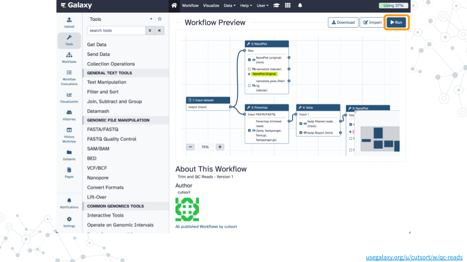

# Taxonomy Profiling

### Overview {-}

#### Purpose {-}

#### Learning Objectives {-}

#### Introduction {-}

### **Activity 1** -- Trim and QC Reads {-}

*Estimated time: 40 min*

#### Instructions {-}

##### 1. Import dataset {-}

- Open the [GTN Pathogen Detection from Nanopore](https://usegalaxy.org/u/cutsort/h/gtn-pathogen-data){target="_blank"} public history
- Click on `Import this history` and then `Copy History`

Confirm `Barcode10_Spike2.fastq.gz` exists in your history by clicking on the Home button in the top menu

##### 2. Run workflow {-}

- Open the [Trim and QC Reads](https://usegalaxy.org/u/cutsort/w/qc-reads){target="_blank"} public workflow
- Click on `Run` and then `Run Workflow` on the `Barcode10_Spike2.fastq.gz` dataset

Wait ~25 minutes as the NanoPlot, Porechop, and fastp jobs are scheduled, run, and complete

##### 3. View results {-}

- Click on the Display icon (eyeball) next to the dataset tagged `NanoPlot-Original`
- Compare the number of reads, length, quality, etc. with the report tagged `NanoPlot-QCed`

#### Questions {-}

| 1A. |
|:-|
|   |

### **Activity 2** -- Taxonomy Profiling {-}

*Estimated time: 50 min*

#### Instructions {-}

##### 1. Run workflow {-}

- Open the [Taxonomy Profiling](https://usegalaxy.org/u/cutsort/w/taxonomy-profiling){target="_blank"} public workflow
- Click on `Run` and then `Run Workflow` with the following parameters
  - Dataset: `fastp on data 5: Read 1 output`
  - kraken_database: `Prebuilt Refseq indexes: PlusPF`
- Wait ~35 minutes as the Kraken2, KrakenTools, and Krona jobs are scheduled, run, and complete

##### 2. View results {-}

- Click on the Display icon (eyeball) next to the dataset tagged `taxonomy_profiling_visualization_krona_pie_chart`
- Examine how many reads were classified as Salmonella, Escherichia coli, Homo sapiens, and Unclassified

#### Questions {-}

| 2A. |
|:-|
|   |

### Footnotes {-}

#### Resources {-}

- Google Doc

#### Contributions and Affiliations {-}

- Jennifer Kerr, Notre Dame of Maryland University
- Rosa Alcazar, Clovis Community College
- Frederick Tan, Johns Hopkins University
- Based on "Pathogen detection from (direct Nanopore) sequencing data using Galaxy - Foodborne Edition" ([GTN](https://gxy.io/GTN:T00393))

Last Revised: August 2024
